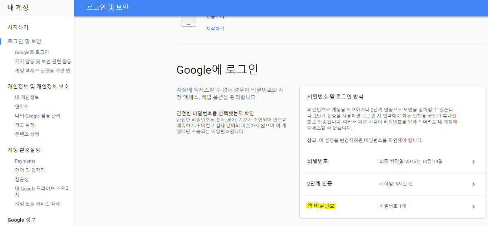
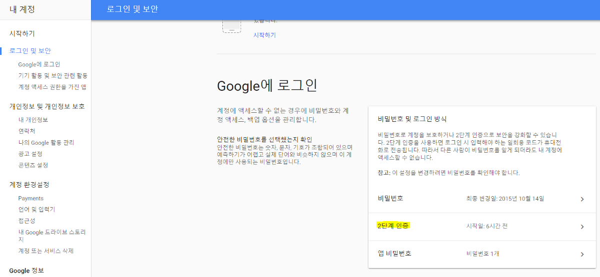

## SMTP mail 예제

```python
import smtplib
from email.mime.text import MIMEText

def sendMail(me, you, msg):
    smtp = smtplib.SMTP_SSL('smtp.gmail.com', 465)
    smtp.login(me, '발급비밀번호')
    msg = MIMEText(msg)
    msg['Subject'] = 'TEST'
    smtp.sendmail(me, you, msg.as_string())
    smtp.quit()

sendMail('me@gmail.com', 'you@gmail.com', '메일보내기')
```

## 관련 클래스 & 메소드

헤맷던 메소드와 사용한 메소드들이다.

`class smtplib.SMTP_SSL([host[, port[, local_hostname[, keyfile[, certfile[, timeout]]]]]])`

`class smtplib.SMTP([host[, port[, local_hostname[, timeout]]]])`

: SSL 사용여부에 따라 선택하여 사용하면 된다. 로컬 SMTP서버가 없어 gmail을 사용하면 되는데 gmail은 SSL을 필수로 사용한다. SMTP connect()메서드가 실행되며 호출에 실패하면 timeout이 발생한다.

`SMTP.login(user, password)` : 인증이 필요한 STMP 서버에 로그인, 매개변수에는 인증할 사용자메일과, 암호이 들어간다.

`SMTP.sendmail(from_addr, to_addrs, msg[, mail_options, rcpt_options])` : 메일발송, 매개변수에는 발신주소, 수신주소, 메시지문자열이 들어간다.

`SMTP.quit()` : SMTP 세션을 종료

`SMTP.starttls([keyfile[, certfile]])` : SMTP 연결을 TLS (전송 계층 보안) 모드로 전환, 뒤 따르는 모든 SMTP 명령은 암호화된다. 그런 다음 ehlo ()를 다시 호출해야한다.

`SMTP.ehlo([hostname])` : EHLO를 사용하여 ESMTP 서버를 확인

`SMTP.helo([hostname])`: HELO를 사용하여 SMTP 서버를 확인

(참고한 URL : https://docs.python.org/2/library/smtplib.html)


## 사전작업

코드를 작성하기 전 구글계정에서 사전작업이 필요하다.

1. **내계정 > 로그인 및 보안**으로 이동한다.
https://myaccount.google.com/security

2. 2단계 인증 절차를 거친다.


3. 앱 비밀번호를 생성한다.


생성된 16자 비밀번호를 `SMTP.login(user, password)`의 password부분에 입력해주면 된다.
