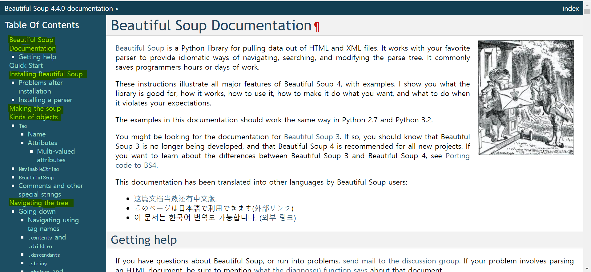
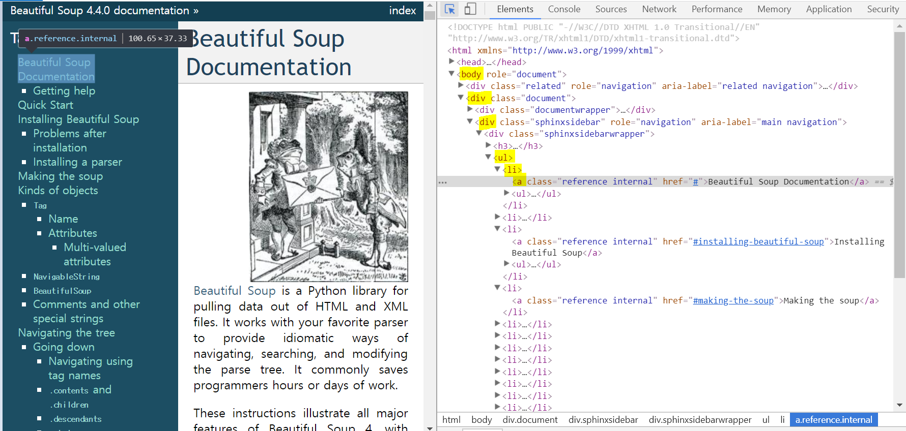

## requests, BeautifulSoup 간단예제

**requests**와 **BeautifulSoup**을 이용해서 웹페이지(https://www.crummy.com/software/BeautifulSoup/bs4/doc/ )의 소제목(?) 리스트를 출력해 볼것이다.


#### 1. requests(웹페이지 읽어오기)<br> 
requests 설치
```bash
pip install requests
```
requests 기본 사용방법 ([URl참고](http://docs.python-requests.org/en/latest/user/quickstart/#make-a-request))
```python
import requests

url = 'https://www.crummy.com/software/BeautifulSoup/bs4/doc'
req = requests.get(url)

print(req.text)
print(req.headers)
print(req.status_code)
```
#### 2. BeautifulSoup(웹페이지 파싱하기)<br> 
BeautifulSoup 설치
```bash
pip install bs4
```
BeautifulSoup 기본 사용방법 ([URl참고](https://www.crummy.com/software/BeautifulSoup/bs4/doc/))
```python
import requests
from bs4 import BeautifulSoup

url = 'https://www.crummy.com/software/BeautifulSoup/bs4/doc'
req = requests.get(url)
html = req.text
soup = BeautifulSoup(html, 'html.parser')

print(soup.prettify())
print(soup.title)
print(soup.p)

for link in soup.find_all('a'):
    print(link.get('href'))
```

#### 3. 전체코드<br> 
```python
# parser.py
import requests
from bs4 import BeautifulSoup

url = 'https://www.crummy.com/software/BeautifulSoup/bs4/doc'
req = requests.get(url)
html = req.text
soup = BeautifulSoup(html, 'html.parser')

titles = soup.select("body > div > div > div > ul > li > a")
for title in titles:
    print(title.text)
```
**requests**라이브러리를 이용하여 웹페이지를 읽어와 Response객체로 반환해준다. 반환된 데이터는 `req.text`를 사용하여 문자열로 리턴한다.
**BeautifulSoup**으로 html소스를 python객체로 변환한다.(Python 내장 파서 `html.parser`를 이용했다.)

출력하려는 리스트들은 _body > div > div > div > ul > li > a_ 규칙을 가지고있다. 
마우스 우클릭 **Copy>Copy selector**로 쉽게 가져올 수 있다. `soup.select`를 이용하면 규칙에 일치하는 모든 객체들을 List로 반환해준다.